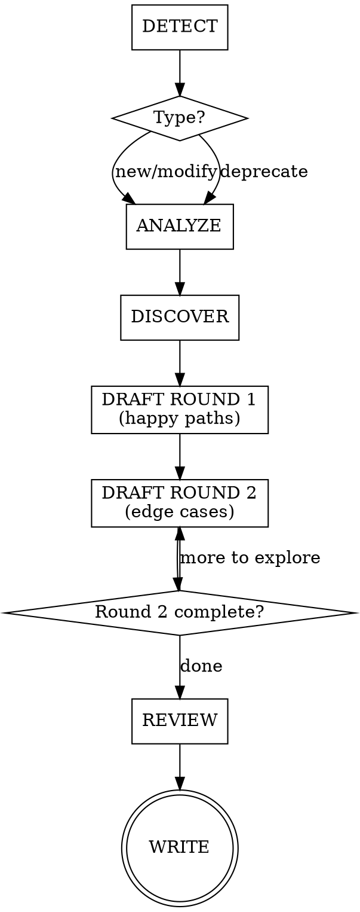

# Writing BDD Scenarios

## Overview

BDD scenarios are requirements, not tests. This skill guides a collaborative PM + developer
session to produce Gherkin scenarios as executable requirements. The AI orchestrates the
conversation, proposes scenarios, and enforces quality guardrails.

## When to Use

- Adding a new feature or capability
- Changing existing behavior
- Removing/deprecating a feature
- Any `.feature` file is about to be created or edited

**When NOT to use:**

- Writing step definitions (Python implementation of steps)
- Writing integration/unit tests
- Implementation planning (that comes after this skill completes)

## Guardrails

### 1. No implementation detail in Gherkin

Describe what the system does, not how. Step definitions own transport/protocol/mechanics.
Even for API-only products — describe what the API delivers, not HTTP mechanics.

### 2. Round 2 is mandatory

AI always pushes for edge cases after happy paths. Team can defer items as "out of scope"
(recorded in decision log) but cannot skip the round. No exceptions: not for "obvious"
features, not for single-scenario features, not when running short on time.

### 3. Use roles for actors, never "the user" or "I"

The role communicates why the actor matters (permissions, responsibilities). For
system-initiated processes (batch jobs, scheduled tasks, events), the job/event is the actor.

### 4. One business trigger per scenario

Each scenario validates one cause-and-effect. Complex workflows use multiple scenarios in
sequence within the same feature file.

### 5. Each scenario tells a complete story

A PM should understand the scenario without reading other scenarios or scrolling up.

Techniques (in preference order):
1. Declarative Given steps — state the situation in business terms
2. Feature description — prose block under `Feature:` for domain context
3. Short Background — max 3-4 lines of truly universal setup
4. Scenario Outlines — for behavioral variations on a theme

Anti-patterns: Background >5 lines, 6+ Given steps, cross-scenario references.

### 6. Then steps describe outcomes, not mechanics

What should be true — not how the system achieves it. Step definitions decide how to verify.

### 7. Use consistent domain language

Same concept = same word everywhere. Clarify ambiguous terms in the Feature description.

### 8. AI proposes first, team edits

AI drafts scenarios based on what it learned in DISCOVER. Team reacts and adjusts.

## Process Flow

**DETECT** — Ask: "Are we adding, modifying, or deprecating?" Routes the flow.

**ANALYZE** — Read existing `.feature` files in the relevant area. Summarize current
scenario landscape. Skip only if greenfield with zero scenarios.

**DISCOVER** — Ask one question at a time (multiple choice preferred): capability,
actors, triggers, outcomes, constraints. Continue until enough context to draft.

**DRAFT ROUND 1** — Propose Feature description + happy path scenarios. Team adjusts.

**DRAFT ROUND 2** — Systematically push for edge cases:
- "What if this fails?"
- "What if the actor doesn't have permission?"
- "What if the input is invalid/missing?"
- "What about concurrency/timing?"
- "What about boundaries (zero, max, empty)?"

Each item: "add it" or "out of scope" (logged).

**REVIEW** — Read back all scenarios. Check: contradictions, duplication, language
consistency, each scenario a complete story.

**WRITE** — Write `.feature` file(s) + decision log. Commit.

**Deprecation shortcut:** DETECT → ANALYZE (identify affected) → DISCOVER (confirm
intent) → REVIEW (ripple effects) → WRITE (remove + decision log).
