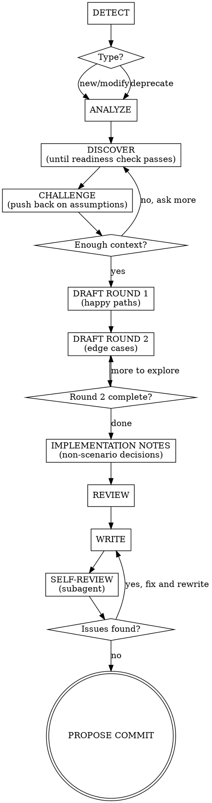

# Writing BDD Scenarios

## Overview

BDD scenarios are requirements, not tests. This skill guides a collaborative PM + developer
session to produce Gherkin scenarios as executable requirements. The AI orchestrates the
conversation, proposes scenarios, and enforces quality guardrails.

## Checklist

You MUST use todowrite to create individual todo items for EACH phase below and track
completion as you progress. If you proceed without creating todos, you are violating this skill.

1. DETECT — identify change type
2. ANALYZE — review existing scenarios
3. DISCOVER — ask questions until readiness check passes
4. CHALLENGE — push back on assumptions
5. DRAFT ROUND 1 — propose happy paths
6. DRAFT ROUND 2 — push for edge cases
7. IMPLEMENTATION NOTES — capture non-scenario decisions
8. REVIEW — check all scenarios together
9. WRITE — write .feature file(s) + decision log
10. SELF-REVIEW — dispatch subagent to review outputs against guardrails
11. PROPOSE COMMIT — ask user if they want to commit

<HARD-GATE>
Do NOT write step definitions, implementation code, Python files, or invoke any implementation
skill. Do NOT proceed past DISCOVER until you pass the readiness check (see DISCOVER phase).
The ONLY outputs of this skill are `.feature` files and a decision log.
This applies to EVERY feature regardless of perceived simplicity. For modifications:
if behavior changes, full DISCOVER applies. Pure typo/formatting fixes do not invoke
this skill.

Asking product-level questions about data handling (trimming, case sensitivity) in the
IMPLEMENTATION NOTES phase is NOT a violation — those are decisions, not code.
</HARD-GATE>

## Anti-Pattern: "This Is Too Simple To Need Discovery"

Every feature goes through the full DISCOVER phase. "CRUD for inventory" sounds obvious but
hides dozens of decisions: Who are the actors? What are the permission boundaries? What
happens on conflict? Is delete soft or hard? What are the validation rules? What does
"success" look like to the business?

**"I already know what they want" is always wrong.** The user told you WHAT — you need to
discover WHY, for WHOM, under WHAT constraints, and WHAT HAPPENS when things go wrong.

## When to Use

- Adding a new feature or capability
- Changing existing behavior
- Removing/deprecating a feature
- Any `.feature` file is about to be created or edited

**When NOT to use:**

- Writing step definitions (Python implementation of steps)
- Writing integration/unit tests
- Implementation planning (that comes after this skill completes)

## Guardrails

### 1. No implementation detail in Gherkin

Describe what the system does, not how. Step definitions own transport/protocol/mechanics.
Even for API-only products — describe what the API delivers, not HTTP mechanics.

### 2. Round 2 is mandatory

AI always pushes for edge cases after happy paths. Team can defer items as "out of scope"
(recorded in decision log) but cannot skip the round. No exceptions: not for "obvious"
features, not for single-scenario features, not when running short on time.

### 3. Use roles for actors, never "the user" or "I"

The role communicates why the actor matters (permissions, responsibilities). For
system-initiated processes (batch jobs, scheduled tasks, events), the job/event is the actor.

### 4. One business trigger per scenario

Each scenario validates one cause-and-effect. Complex workflows use multiple scenarios in
sequence within the same feature file.

### 5. Each scenario tells a complete story

A PM should understand the scenario without reading other scenarios or scrolling up.

Techniques (in preference order):
1. Declarative Given steps — state the situation in business terms
2. Feature description — prose block under `Feature:` for domain context
3. Short Background — max 3-4 lines of truly universal setup
4. Scenario Outlines — for behavioral variations on a theme

Anti-patterns: Background >5 lines, 6+ Given steps, cross-scenario references.

### 6. Then steps describe outcomes, not mechanics

What should be true — not how the system achieves it. Step definitions decide how to verify.

### 7. Use consistent domain language

Same concept = same word everywhere. Clarify ambiguous terms in the Feature description.

### 8. AI proposes first, team edits

AI drafts scenarios based on what it learned in DISCOVER. Team reacts and adjusts.

### 9. One question per message — no compound questions

During DISCOVER, ask exactly ONE question per message. Wait for the answer before asking
the next. Do NOT batch questions. Do NOT ask-and-answer in one shot. If the user
explicitly requests batched questions, comply — but still require all mandatory topics
answered before proceeding to CHALLENGE.

A compound question like "Is SKU unique? And what about quantity — must it be non-negative?
And for delete — hard or soft?" is THREE questions. Split them into three messages.

### 10. Probe thin answers

When the user gives a one-word or one-line answer, follow up. "It should fail" — ask WHY
it should fail, what the user experience should be, what error they'd expect. Short answers
often hide unstated assumptions. Your job is to draw those out.

Example — User says "It should fail." Good follow-up: "What should the caller see when it
fails? An error message? Should they be able to retry? Does it matter whether the failure
is transient or permanent?"

### 11. Challenge assumptions before accepting direction

Act like a good PM. Push back on scope, question implicit assumptions, surface hidden
complexity. "You said X — but have you considered Y?" is required at least once before
moving to DRAFT.

## Process Flow



**DETECT** — Ask: "Are we adding, modifying, or deprecating?" Routes the flow.

**ANALYZE** — Read existing `.feature` files in the relevant area. Summarize current
scenario landscape. Skip only if greenfield with zero scenarios.

**DISCOVER** — Ask one question at a time (multiple choice preferred): capability,
actors, triggers, outcomes, constraints. Continue until you pass the readiness check.

**Readiness check — you may move to CHALLENGE only when you can answer ALL of these:**
- Who are the actors and what are their roles/permissions?
- What triggers the behavior?
- What does success look like from the business perspective?
- What are the constraints/validation rules?
- What happens when things go wrong (errors, edge cases)?
- How does this interact with existing features?

If ANY answer is "I don't know yet" or "I'm guessing" — keep asking. Do NOT move forward
with assumptions. The readiness check is the ONLY exit condition — number of questions is
irrelevant. Typical discovery takes 5-8 questions. If you've asked fewer than 5, verify
carefully that every readiness criterion is genuinely covered.

**CHALLENGE** — After initial discovery, push back on at least one assumption:
- "You said X — do you actually need all of X, or just Y?"
- "What about [edge case the user hasn't mentioned]?"
- "Is [implied requirement] actually necessary, or is it assumed?"
- "How does this interact with [existing capability]?"

The goal is to surface hidden complexity BEFORE drafting. A good PM doesn't just
transcribe requirements — they interrogate them. A challenge that gets "yes, that's
fine" without revealing anything new wasn't a real challenge. Push until you surface
at least one previously unstated constraint, edge case, or scope clarification.

**DRAFT ROUND 1** — Propose Feature description + happy path scenarios. Team adjusts.

**DRAFT ROUND 2** — Systematically push for edge cases:
- "What if this fails?"
- "What if the actor doesn't have permission?"
- "What if the input is invalid/missing?"
- "What about concurrency/timing?"
- "What about boundaries (zero, max, empty)?"

Each item: "add it" or "out of scope" (logged). Items marked "out of scope" go to the
decision log's Out of Scope section — they are NOT implementation notes (which capture
how in-scope items behave at the technical boundary).

**IMPLEMENTATION NOTES** — After edge cases are settled, probe for decisions that affect
implementation but don't warrant their own scenario. Ask about:
- Data normalization (whitespace trimming, case folding, encoding)
- Input sanitization that's invisible to the user
- Behavior when validated input is technically valid but degenerate (e.g., name is all spaces after trimming)
- Whether exact boundary precision matters to the business (e.g., "must reject at exactly 128 chars" vs "reject unreasonably long input")

**The boundary:** You may ask questions whose answers are **decisions** (a product owner
would have an opinion). You may NOT ask questions whose answers are **code** (only an
engineer would care).

| OK to ask | NOT OK to ask |
|-----------|---------------|
| "Should whitespace be trimmed?" | "Should we use regex or `strip()`?" |
| "Is comparison case-insensitive?" | "Use `.lower()` or `.casefold()`?" |
| "What happens if input is all spaces?" | "Store in Redis or Postgres?" |

Record answers in the decision log under **Implementation Notes** (see template below).
This section is the bridge between the BDD session and the implementing agent — without
it, these decisions get lost between sessions.

**REVIEW** — Read back all scenarios. Check: contradictions, duplication, language
consistency, each scenario a complete story.

**WRITE** — Write `.feature` file(s) + decision log. Nothing else.

**SELF-REVIEW** — Dispatch a subagent to review the written `.feature` file(s) and decision
log against ALL guardrails. The subagent reads the files fresh (no conversation context bias)
and checks:

1. No implementation detail in Gherkin (no HTTP, JSON, DB references)
2. Actors use roles, never "the user" or "I"
3. One business trigger per scenario
4. Each scenario tells a complete story (understandable in isolation)
5. Then steps describe outcomes, not mechanics
6. Consistent domain language across all scenarios
7. Feature description provides adequate context
8. Decision log is complete (context, decisions, implementation notes, out of scope, affected scenarios)

The subagent returns a list of issues or "PASS". If issues are found, fix them and re-run
the self-review. Only proceed to PROPOSE COMMIT after a clean pass.

Subagent prompt template:
> "You are a skeptical product manager reading these scenarios for the first time, with
> no prior context about the conversation that produced them. Read the following files:
> [list .feature and decision log paths]. Review them against these quality criteria:
> [criteria above]. For each issue found, report the file, line, and which criterion is
> violated. If all criteria pass, respond with PASS."

Then ask: "Shall I commit these files?"

**Deprecation shortcut:** DETECT → ANALYZE (identify affected) → DISCOVER (confirm
intent) → REVIEW (ripple effects) → WRITE (remove + decision log).

## Decision Log Template

Write to `docs/decisions-log/<unix-timestamp>-<feature-area>.md`:

````markdown
# <Feature Area>

- **Date:** YYYY-MM-DD
- **Type:** new | modification | deprecation

## Context

<1-3 sentences: why this session happened>

## Decisions

- <Decision> — <brief rationale>

## Implementation Notes

Decisions that don't warrant their own scenario but must be respected during implementation:

- <Behavior> — <what was decided>

Example entries:
- Names: trim leading/trailing whitespace before validation
- Email: normalize to lowercase for comparison
- Empty-after-trim: treat as "missing" (same error as blank input)
- Exact boundaries (min/max values): cover with unit tests at boundary values

## Out of Scope

- <Item consciously deferred>

## Affected Scenarios

- <path to .feature file(s) created/modified/removed>
````

## Example

**Good — business outcomes, roles, declarative:**

```gherkin
Feature: Purchase order approval

  Orders above the approval threshold require manager sign-off
  before they can be processed by the warehouse.

  Scenario: Order above threshold requires approval
    Given a purchase order for $15,000 requiring manager approval
    When the department manager approves it
    Then the purchase order is sent to the warehouse for fulfillment

  Scenario: Order below threshold is auto-approved
    Given a purchase order for $500
    When it is submitted
    Then it is automatically sent to the warehouse
```

**Bad — implementation detail, anonymous actors, mechanics:**

```gherkin
Scenario: POST /orders with amount > threshold returns 202
  When I POST to "/orders" with {"amount": 15000}
  Then the response status is 202
  And the JSON body contains {"status": "pending_approval"}
  And a row is inserted into the approvals table
```

## Red Flags — STOP

If you're thinking any of these, you're about to violate the process:

| Thought | Reality |
|---------|---------|
| "The PM already knows what they want" | Round 2 exists because first-pass requirements always have gaps |
| "This is too simple for the full process" | Simple features hide edge cases. Follow all phases. |
| "I'll just write the Gherkin directly" | AI proposes first so humans can react, not invent from scratch |
| "We don't need a decision log for this" | Decision logs prevent relitigating resolved decisions next sprint |
| "Let me add HTTP details so the developer knows" | Step definitions own transport. Gherkin is for business behavior. |
| "This is just a test" | These are requirements. The executable part is a bonus. |
| "Round 2 is overkill for this feature" | Round 2 is mandatory. No exceptions. Defer items as out-of-scope if needed. |
| "CRUD is obvious, I know what they need" | CRUD hides dozens of decisions. Discovery surfaces them. Ask questions. |
| "I'll write the scenarios and step defs together" | Step defs are implementation. This skill produces ONLY .feature files. |
| "Let me implement this while I'm at it" | Implementation is a separate task. Stop after .feature + decision log. |
| "I have enough context from the request" | You have WHAT. You need WHY, for WHOM, under WHAT constraints. Ask. |
| "I'll ask all my questions at once to save time" | One question per message. Wait for answers. Discovery is a conversation. |
| "I'll ask about Create, Read, Update, Delete in one go" | That's 4 questions. Split them. Each operation deserves its own exploration. |
| "They gave a short answer, I'll just accept it" | Short answers hide assumptions. Probe: "Why? What does that look like? What error?" |
| "Implementation notes are out of scope for BDD" | Non-scenario decisions get lost between sessions. Capture them or the implementing agent will guess wrong. |
| "Asking about trimming is too technical for BDD" | "Should whitespace be trimmed?" is a product decision. HOW to trim is technical. |

## Exit Criteria

Done when:
1. `.feature` file(s) written and approved by the team
2. Decision log written to `docs/decisions-log/<timestamp>-<feature-area>.md`
3. Self-review subagent returned PASS (no guardrail violations)
4. User asked whether to commit (do not commit without explicit yes)

After writing, always ask: "Shall I commit these files?"

State: "Requirements are captured. Implementation can proceed separately."

This skill does NOT write step definitions, implementation code, or invoke other skills.
No exceptions. Not even "just stubs." Not even "just an outline." ONLY `.feature` files
and the decision log.
