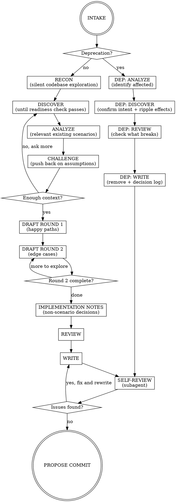

# Writing BDD Scenarios

## Overview

BDD scenarios are executable acceptance criteria — requirements, not tests. This skill
guides a collaborative PM + developer session to produce Gherkin scenarios as executable
requirements. The AI orchestrates the conversation, proposes scenarios, and enforces
quality guardrails.

## Checklist

You MUST use todowrite to create individual todo items for EACH phase below and track
completion as you progress. If you proceed without creating todos, you are violating this skill.

1. INTAKE — collect user's intent in their own words
2. RECON — silently explore the target service's codebase
3. DISCOVER — ask questions the codebase doesn't answer
4. ANALYZE — review existing scenarios relevant to the discovered requirement
5. CHALLENGE — push back on assumptions
6. DRAFT ROUND 1 — propose happy paths
7. DRAFT ROUND 2 — push for edge cases
8. IMPLEMENTATION NOTES — capture non-scenario decisions
9. REVIEW — check all scenarios together
10. WRITE — write .feature file(s) + decision log
11. SELF-REVIEW — dispatch subagent to review outputs against guardrails
12. PROPOSE COMMIT — ask user if they want to commit

<HARD-GATE>
Do NOT write step definitions, implementation code, Python files, or invoke any implementation
skill. Do NOT proceed past DISCOVER until you pass the readiness check (see DISCOVER phase).
The ONLY outputs of this skill are `.feature` files and a decision log.
This applies to EVERY feature regardless of perceived simplicity. For modifications:
if behavior changes, full DISCOVER applies. Pure typo/formatting fixes do not invoke
this skill.

Asking product-level questions about data handling (trimming, case sensitivity) in the
IMPLEMENTATION NOTES phase is NOT a violation — those are decisions, not code.
</HARD-GATE>

## When to Use

- Adding a new feature or capability
- Changing existing behavior
- Removing/deprecating a feature
- Any `.feature` file is about to be created or edited

**When NOT to use:**

- Writing step definitions (Python implementation of steps)
- Writing integration/unit tests
- Implementation planning (that comes after this skill completes)

## Guardrails

### 1. No implementation detail in Gherkin

Describe what the system does, not how. Step definitions own transport/protocol/mechanics.
Even for API-only products — describe what the API delivers, not HTTP mechanics.

### 2. Round 2 is mandatory

AI always pushes for edge cases after happy paths. Team can defer items as "out of scope"
(recorded in decision log) but cannot skip the round. No exceptions.

### 3. Use roles for actors, never "the user" or "I"

The role communicates why the actor matters (permissions, responsibilities). For
system-initiated processes (batch jobs, scheduled tasks, events), the job/event is the actor.

### 4. One business trigger per scenario

Each scenario validates one cause-and-effect. Complex workflows use multiple scenarios in
sequence within the same feature file.

### 5. Each scenario tells a complete story

A PM should understand the scenario without reading other scenarios or scrolling up.

Techniques (in preference order):
1. Declarative Given steps — state the situation in business terms
2. Feature description — prose block under `Feature:` for domain context
3. Short Background — max 3-4 lines of truly universal setup
4. Scenario Outlines — for behavioral variations on a theme

Anti-patterns: Background >5 lines, 6+ Given steps, cross-scenario references.

### 6. Then steps describe outcomes, not mechanics

What should be true — not how the system achieves it. Step definitions decide how to verify.

### 7. Use consistent domain language

Same concept = same word everywhere. Clarify ambiguous terms in the Feature description.

### 8. AI proposes first, team edits

AI drafts scenarios based on what it learned in DISCOVER. Team reacts and adjusts.

### 9. One question per message — no compound questions

During DISCOVER, ask exactly ONE question per message. Wait for the answer before asking
the next. Do NOT batch questions. If the user explicitly requests batched questions,
comply — but still require all mandatory topics answered before proceeding to CHALLENGE.

### 10. Probe thin answers

When the user gives a one-word or one-line answer, follow up. "It should fail" — ask WHY
it should fail, what the user experience should be, what error they'd expect. Short answers
often hide unstated assumptions.

### 11. Challenge assumptions before accepting direction

Push back on scope, question implicit assumptions, surface hidden complexity. Required at
least once before moving to DRAFT.

## Process Flow



## Phase Details

**INTAKE** — Ask: "What would you like to build or change?" Let the user describe their
intent freely. Listen for scope, motivation, and implicit constraints.

After the user responds, acknowledge their intent in 1-2 sentences before moving on.
The user's response already tells you the change type (new/modify/deprecate) — you don't
need to ask explicitly. Confirm briefly if ambiguous.

**Handling user overrides:** If the user says "skip ahead" — acknowledge, note what may be
missed, and comply. Still enforce the HARD-GATE: no implementation code regardless.

**RECON** — Silently explore the target service's codebase BEFORE asking the user anything.
Do NOT output findings to the user. The goal is to build internal context so DISCOVER
doesn't ask questions the code already answers.

Read (silently):
- The service's AGENTS.md
- All existing `.feature` files in the service
- Source code directory structure
- Source files related to the user's stated intent

**RECON is the single source of truth for "what IS."** The user is the source of truth for
"what SHOULD BE." Never ask the user to confirm facts the codebase already shows.

**DISCOVER** — Ask one question at a time (multiple choice preferred): capability,
actors, triggers, outcomes, constraints. Continue until you pass the readiness check.
Don't re-ask what the user told you in INTAKE or what you learned in RECON.

**Readiness check — you may move to ANALYZE only when you can answer ALL of these:**
- Who are the actors and what are their roles/permissions?
- What triggers the behavior?
- What does success look like from the business perspective?
- What are the constraints/validation rules?
- What happens when things go wrong (errors, edge cases)?
- How does this interact with existing features?

Answers can come from RECON, INTAKE, or DISCOVER questions. If RECON + INTAKE already
cover most criteria, DISCOVER may be very short (even 1-2 questions). Don't ask questions
just to hit a number.

**ANALYZE** — Read existing `.feature` files in the relevant area. Summarize to the user
what exists, what overlaps, what might be affected. Skip only if greenfield with zero
scenarios.

**CHALLENGE** — Push back on at least one assumption. You're armed with both what the user
wants AND what already exists. Push until you surface at least one previously unstated
constraint, edge case, or scope clarification.

**DRAFT ROUND 1** — Propose Feature description + happy path scenarios. Team adjusts.

**DRAFT ROUND 2** — Systematically push for edge cases: failure, permissions, invalid
input, concurrency, boundaries. Each item: "add it" or "out of scope" (logged in
decision log's Out of Scope section).

**IMPLEMENTATION NOTES** — Probe for decisions that affect implementation but don't
warrant their own scenario: data normalization, input sanitization, degenerate input
behavior, boundary precision.

| OK to ask | NOT OK to ask |
|-----------|---------------|
| "Should whitespace be trimmed?" | "Should we use regex or `strip()`?" |
| "Is comparison case-insensitive?" | "Use `.lower()` or `.casefold()`?" |
| "What happens if input is all spaces?" | "Store in Redis or Postgres?" |

Record answers in the decision log under **Implementation Notes**.

**REVIEW** — Read back all scenarios. Check: contradictions, duplication, language
consistency, each scenario a complete story.

**WRITE** — Write `.feature` file(s) + decision log. Nothing else.

**SELF-REVIEW** — Dispatch a subagent to review the written files against ALL guardrails.
The subagent reads files fresh (no conversation context bias) and checks:

1. No implementation detail in Gherkin
2. Actors use roles, never "the user" or "I"
3. One business trigger per scenario
4. Each scenario tells a complete story
5. Then steps describe outcomes, not mechanics
6. Consistent domain language
7. Feature description provides adequate context
8. Decision log is complete

Subagent prompt template:
> "You are a skeptical product manager reading these scenarios for the first time, with
> no prior context about the conversation that produced them. Read the following files:
> [list paths]. Review them against these quality criteria: [criteria above]. For each
> issue found, report the file, line, and which criterion is violated. If all criteria
> pass, respond with PASS."

Only proceed to PROPOSE COMMIT after a clean pass.

**Deprecation shortcut:** INTAKE → ANALYZE (identify affected) → DISCOVER (confirm intent,
ripple effects) → REVIEW (what breaks) → WRITE (remove + decision log) → SELF-REVIEW →
PROPOSE COMMIT. Skip DRAFT rounds and IMPLEMENTATION NOTES.

## Decision Log Template

Write to `docs/decisions-log/<unix-timestamp>-<feature-area>.md`:

````markdown
# <Feature Area>

- **Date:** YYYY-MM-DD
- **Type:** new | modification | deprecation

## Context

<1-3 sentences: why this session happened>

## Decisions

- <Decision> — <brief rationale>

## Implementation Notes

Decisions that don't warrant their own scenario but must be respected during implementation:

- <Behavior> — <what was decided>

## Out of Scope

- <Item consciously deferred>

## Affected Scenarios

- <path to .feature file(s) created/modified/removed>
````

## Example

**Good — business outcomes, roles, declarative:**

```gherkin
Feature: Purchase order approval

  Orders above the approval threshold require manager sign-off
  before they can be processed by the warehouse.

  Scenario: Order above threshold requires approval
    Given a purchase order for $15,000 requiring manager approval
    When the department manager approves it
    Then the purchase order is sent to the warehouse for fulfillment

  Scenario: Order below threshold is auto-approved
    Given a purchase order for $500
    When it is submitted
    Then it is automatically sent to the warehouse
```

**Bad — implementation detail, anonymous actors, mechanics:**

```gherkin
Scenario: POST /orders with amount > threshold returns 202
  When I POST to "/orders" with {"amount": 15000}
  Then the response status is 202
  And the JSON body contains {"status": "pending_approval"}
  And a row is inserted into the approvals table
```

## Red Flags — STOP

If you're thinking any of these, you're about to violate the process:

| Thought | Reality |
|---------|---------|
| "This is too simple for the full process" | Simple features hide edge cases. Follow all phases. |
| "We don't need a decision log for this" | Decision logs prevent relitigating resolved decisions next sprint. |
| "I'll just write the Gherkin directly" | AI proposes first so humans can react, not invent from scratch. |
| "I'll ask all my questions at once" | One question per message. Discovery is a conversation. |
| "They gave a short answer, I'll accept it" | Short answers hide assumptions. Probe deeper. |
| "Let me add HTTP details for the developer" | Step definitions own transport. Gherkin is for business behavior. |
| "Round 2 is overkill for this feature" | Round 2 is mandatory. Defer items as out-of-scope if needed. |
| "I should ask if X already exists" | Read the code first (RECON). Don't ask about codebase facts. |
| "Let me implement this while I'm at it" | This skill produces ONLY .feature files + decision log. Stop there. |
| "I have enough context from the request" | You have WHAT. You need WHY, for WHOM, under WHAT constraints. |
| "Implementation notes are out of scope for BDD" | Non-scenario decisions get lost between sessions. Capture them. |

## Exit Criteria

Done when:
1. `.feature` file(s) written
2. Decision log written to `docs/decisions-log/<timestamp>-<feature-area>.md`
3. Self-review subagent returned PASS (no guardrail violations)
4. User asked whether to commit (do not commit without explicit yes)

After writing, always ask: "Shall I commit these files?"

State: "Requirements are captured. Implementation can proceed separately."

This skill does NOT write step definitions, implementation code, or invoke other skills.
No exceptions. Not even "just stubs." Not even "just an outline." ONLY `.feature` files
and the decision log.
