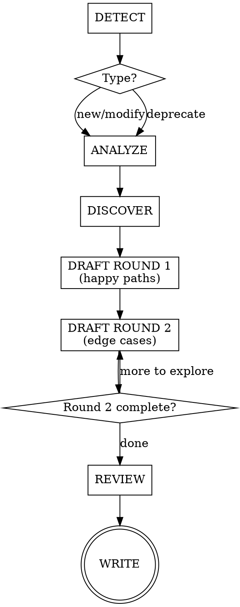

# Writing BDD Scenarios Skill — Implementation Plan

> **For agentic workers:** REQUIRED SUB-SKILL: Use superpowers:subagent-driven-development (recommended) or superpowers:executing-plans to implement this plan task-by-task. Steps use checkbox (`- [ ]`) syntax for tracking.

**Goal:** Replace the existing `writing-bdd-scenarios` skill with a comprehensive process skill that guides collaborative BDD requirements sessions.

**Architecture:** Single skill file (SKILL.md ~300 lines) with one supporting file (EXAMPLE-SESSION.md ~80 lines). The skill is a process/discipline skill — tested via pressure scenarios with subagents, not unit tests.

**Tech Stack:** Markdown skill files, DOT flowchart syntax, Gherkin examples

---

## File Map

| File | Responsibility |
|------|---------------|
| `.claude/skills/writing-bdd-scenarios/SKILL.md` | Main skill — replaces existing content entirely |
| `.claude/skills/writing-bdd-scenarios/EXAMPLE-SESSION.md` | Compressed conversation walkthrough showing all 7 phases |

---

### Task 1: Write SKILL.md — Frontmatter + Overview + When to Use

**Files:**
- Modify: `.claude/skills/writing-bdd-scenarios/SKILL.md` (replace entirely)

- [ ] **Step 1: Write the frontmatter, overview, and When to Use sections**

```markdown
---
name: writing-bdd-scenarios
description: Use when adding, modifying, or removing any feature or business requirement — before writing implementation code or .feature files
---

# Writing BDD Scenarios

## Overview

BDD scenarios are requirements, not tests. This skill guides a collaborative PM + developer
session to produce Gherkin scenarios as executable requirements. The AI orchestrates the
conversation, proposes scenarios, and enforces quality guardrails.

## When to Use

- Adding a new feature or capability
- Changing existing behavior
- Removing/deprecating a feature
- Any `.feature` file is about to be created or edited

**When NOT to use:**

- Writing step definitions (Python implementation of steps)
- Writing integration/unit tests
- Implementation planning (that comes after this skill completes)
```

- [ ] **Step 2: Verify the file parses correctly**

Run: `head -5 .claude/skills/writing-bdd-scenarios/SKILL.md`
Expected: YAML frontmatter with `---` delimiters, `name` and `description` fields present.

- [ ] **Step 3: Commit**

```bash
git add .claude/skills/writing-bdd-scenarios/SKILL.md
git commit -m "docs: replace writing-bdd-scenarios skill — frontmatter and overview"
```

---

### Task 2: Write SKILL.md — Guardrails Section

**Files:**
- Modify: `.claude/skills/writing-bdd-scenarios/SKILL.md` (append)

- [ ] **Step 1: Append the 8 guardrails**

Add after the "When NOT to use" section:

```markdown
## Guardrails

### 1. No implementation detail in Gherkin

Describe what the system does, not how. Step definitions own transport/protocol/mechanics.
Even for API-only products — describe what the API delivers, not HTTP mechanics.

### 2. Round 2 is mandatory

AI always pushes for edge cases after happy paths. Team can defer items as "out of scope"
(recorded in decision log) but cannot skip the round. No exceptions: not for "obvious"
features, not for single-scenario features, not when running short on time.

### 3. Use roles for actors, never "the user" or "I"

The role communicates why the actor matters (permissions, responsibilities). For
system-initiated processes (batch jobs, scheduled tasks, events), the job/event is the actor.

### 4. One business trigger per scenario

Each scenario validates one cause-and-effect. Complex workflows use multiple scenarios in
sequence within the same feature file.

### 5. Each scenario tells a complete story

A PM should understand the scenario without reading other scenarios or scrolling up.

Techniques (in preference order):
1. Declarative Given steps — state the situation in business terms
2. Feature description — prose block under `Feature:` for domain context
3. Short Background — max 3-4 lines of truly universal setup
4. Scenario Outlines — for behavioral variations on a theme

Anti-patterns: Background >5 lines, 6+ Given steps, cross-scenario references.

### 6. Then steps describe outcomes, not mechanics

What should be true — not how the system achieves it. Step definitions decide how to verify.

### 7. Use consistent domain language

Same concept = same word everywhere. Clarify ambiguous terms in the Feature description.

### 8. AI proposes first, team edits

AI drafts scenarios based on what it learned in DISCOVER. Team reacts and adjusts.
```

- [ ] **Step 2: Verify line count is on track**

Run: `wc -l .claude/skills/writing-bdd-scenarios/SKILL.md`
Expected: ~70-90 lines so far (leaving room for remaining sections within ~300 target).

- [ ] **Step 3: Commit**

```bash
git add .claude/skills/writing-bdd-scenarios/SKILL.md
git commit -m "docs: add guardrails section to writing-bdd-scenarios skill"
```

---

### Task 3: Write SKILL.md — Process Flow Section

**Files:**
- Modify: `.claude/skills/writing-bdd-scenarios/SKILL.md` (append)

- [ ] **Step 1: Append the process flow with DOT flowchart**

Add after Guardrails section:

```markdown
## Process Flow



**DETECT** — Ask: "Are we adding, modifying, or deprecating?" Routes the flow.

**ANALYZE** — Read existing `.feature` files in the relevant area. Summarize current
scenario landscape. Skip only if greenfield with zero scenarios.

**DISCOVER** — Ask one question at a time (multiple choice preferred): capability,
actors, triggers, outcomes, constraints. Continue until enough context to draft.

**DRAFT ROUND 1** — Propose Feature description + happy path scenarios. Team adjusts.

**DRAFT ROUND 2** — Systematically push for edge cases:
- "What if this fails?"
- "What if the actor doesn't have permission?"
- "What if the input is invalid/missing?"
- "What about concurrency/timing?"
- "What about boundaries (zero, max, empty)?"

Each item: "add it" or "out of scope" (logged).

**REVIEW** — Read back all scenarios. Check: contradictions, duplication, language
consistency, each scenario a complete story.

**WRITE** — Write `.feature` file(s) + decision log. Commit.

**Deprecation shortcut:** DETECT → ANALYZE (identify affected) → DISCOVER (confirm
intent) → REVIEW (ripple effects) → WRITE (remove + decision log).
```

- [ ] **Step 2: Verify line count**

Run: `wc -l .claude/skills/writing-bdd-scenarios/SKILL.md`
Expected: ~150-180 lines (on track for ~300 total).

- [ ] **Step 3: Commit**

```bash
git add .claude/skills/writing-bdd-scenarios/SKILL.md
git commit -m "docs: add process flow section with DOT flowchart"
```

---

### Task 4: Write SKILL.md — Decision Log Template + Example + Red Flags + Exit Criteria

**Files:**
- Modify: `.claude/skills/writing-bdd-scenarios/SKILL.md` (append)

- [ ] **Step 1: Append decision log template**

```markdown
## Decision Log Template

Write to `docs/decisions-log/<unix-timestamp>-<feature-area>.md`:

```markdown
# <Feature Area>

- **Date:** YYYY-MM-DD
- **Type:** new | modification | deprecation

## Context

<1-3 sentences: why this session happened>

## Decisions

- <Decision> — <brief rationale>

## Out of Scope

- <Item consciously deferred>

## Affected Scenarios

- <path to .feature file(s) created/modified/removed>
```
```

- [ ] **Step 2: Append good/bad Gherkin example**

```markdown
## Example

**Good — business outcomes, roles, declarative:**
```gherkin
Feature: Purchase order approval

  Orders above the approval threshold require manager sign-off
  before they can be processed by the warehouse.

  Scenario: Order above threshold requires approval
    Given a purchase order for $15,000 requiring manager approval
    When the department manager approves it
    Then the purchase order is sent to the warehouse for fulfillment

  Scenario: Order below threshold is auto-approved
    Given a purchase order for $500
    When it is submitted
    Then it is automatically sent to the warehouse
```

**Bad — implementation detail, anonymous actors, mechanics:**
```gherkin
Scenario: POST /orders with amount > threshold returns 202
  When I POST to "/orders" with {"amount": 15000}
  Then the response status is 202
  And the JSON body contains {"status": "pending_approval"}
  And a row is inserted into the approvals table
```
```

- [ ] **Step 3: Append red flags and rationalization table**

```markdown
## Red Flags — STOP

If you're thinking any of these, you're about to violate the process:

| Thought | Reality |
|---------|---------|
| "The PM already knows what they want" | Round 2 exists because first-pass requirements always have gaps |
| "This is too simple for the full process" | Simple features hide edge cases. Follow all phases. |
| "I'll just write the Gherkin directly" | AI proposes first so humans can react, not invent from scratch |
| "We don't need a decision log for this" | Decision logs prevent relitigating resolved decisions next sprint |
| "Let me add HTTP details so the developer knows" | Step definitions own transport. Gherkin is for business behavior. |
| "This is just a test" | These are requirements. The executable part is a bonus. |
| "Round 2 is overkill for this feature" | Round 2 is mandatory. No exceptions. Defer items as out-of-scope if needed. |
```

- [ ] **Step 4: Append exit criteria**

```markdown
## Exit Criteria

Done when:
1. `.feature` file(s) written and approved by the team
2. Decision log written to `docs/decisions-log/<timestamp>-<feature-area>.md`
3. Both artifacts committed to git

State: "Requirements are captured. Implementation can proceed separately."

This skill does NOT write step definitions, implementation code, or invoke other skills.
```

- [ ] **Step 5: Verify final line count**

Run: `wc -l .claude/skills/writing-bdd-scenarios/SKILL.md`
Expected: 250-320 lines (within target).

- [ ] **Step 6: Commit**

```bash
git add .claude/skills/writing-bdd-scenarios/SKILL.md
git commit -m "docs: add decision log, example, red flags, and exit criteria"
```

---

### Task 5: Write EXAMPLE-SESSION.md

**Files:**
- Create: `.claude/skills/writing-bdd-scenarios/EXAMPLE-SESSION.md`

- [ ] **Step 1: Write the compressed conversation example**

```markdown
# Example Session — Invoice Matching (ETL Service)

Compressed walkthrough showing all phases. This is how the AI guides the session.

---

## DETECT

**AI:** Are we adding a new feature, modifying existing behavior, or deprecating something?
**Team:** New feature — we need invoice matching for our I2P system.

## ANALYZE

**AI:** I've read the existing scenarios in `services/invoices/features/`. Currently there
are scenarios for invoice ingestion and validation. No matching scenarios exist yet.

## DISCOVER

**AI:** What triggers the matching process?
- A) Batch job on a schedule
- B) On invoice arrival
- C) Manual trigger by a user

**Team:** A — nightly batch job.

**AI:** What does "matching" mean here? What's being matched to what?
**Team:** Invoices matched to purchase orders by PO number and amount (within 5% tolerance).

**AI:** What happens to unmatched invoices?
**Team:** Flagged for manual review by the AP clerk.

**AI:** Are there any constraints — e.g., an invoice can match multiple POs, or strictly one-to-one?
**Team:** One-to-one only.

## DRAFT ROUND 1

**AI proposes:**

```gherkin
Feature: Invoice matching

  The nightly matching job pairs incoming invoices with purchase orders.
  Matched invoices proceed to payment. Unmatched invoices are flagged for review.

  Scenario: Invoice matches a purchase order exactly
    Given an invoice for $1,000 referencing PO-123
    And PO-123 exists for $1,000
    When the matching job runs
    Then the invoice is matched to PO-123

  Scenario: Invoice within tolerance matches
    Given an invoice for $1,040 referencing PO-456
    And PO-456 exists for $1,000
    When the matching job runs
    Then the invoice is matched to PO-456

  Scenario: Unmatched invoice is flagged
    Given an invoice referencing PO-789
    And PO-789 does not exist
    When the matching job runs
    Then the invoice is flagged for manual review by the AP clerk
```

**Team:** Looks good. Approved.

## DRAFT ROUND 2

**AI:** What if an invoice exceeds the 5% tolerance?
**Team:** Add it — flagged for review.

**AI:** What if two invoices reference the same PO?
**Team:** First one matches, second is flagged. Add it.

**AI:** What if the PO is already matched to another invoice?
**Team:** Same — flagged. Add it.

**AI:** What about an invoice with amount zero or negative?
**Team:** Out of scope — validation catches that upstream.

## REVIEW

**AI:** Final set: 6 scenarios. No contradictions with existing features. Language is
consistent ("flagged for manual review" used uniformly). Each scenario is self-contained.

## WRITE

**AI:** Written to `services/invoices/features/matching.feature` and
`docs/decisions-log/1746612345-invoice-matching.md`. Committed.

Requirements are captured. Implementation can proceed separately.
```

- [ ] **Step 2: Verify line count**

Run: `wc -l .claude/skills/writing-bdd-scenarios/EXAMPLE-SESSION.md`
Expected: ~80-100 lines.

- [ ] **Step 3: Commit**

```bash
git add .claude/skills/writing-bdd-scenarios/EXAMPLE-SESSION.md
git commit -m "docs: add example session walkthrough for BDD skill"
```

---

### Task 6: Baseline Testing — Run Pressure Scenario WITHOUT Skill

**Files:** None modified — this is a test run.

- [ ] **Step 1: Dispatch a subagent to simulate a BDD session WITHOUT the skill loaded**

Prompt the subagent with:
> "A product manager and developer want to add invoice matching to their I2P system.
> Help them write BDD scenarios. The nightly batch job matches invoices to POs by
> number and amount (5% tolerance). Unmatched invoices go to the AP clerk."

Do NOT load the writing-bdd-scenarios skill. Observe:
- Does it ask discovery questions or jump straight to writing?
- Does it push for edge cases?
- Does it use roles or anonymous actors?
- Does it include implementation details?
- Does it produce a decision log?

- [ ] **Step 2: Document baseline behavior**

Record verbatim what the agent did wrong. Capture rationalizations. This becomes the evidence that the skill is needed.

- [ ] **Step 3: No commit needed — this is observational**

---

### Task 7: Verification Testing — Run Pressure Scenario WITH Skill

**Files:** None modified — this is a test run.

- [ ] **Step 1: Dispatch a subagent with the skill loaded**

Same prompt as Task 6, but this time load the `writing-bdd-scenarios` skill first.

Verify:
- Does it follow the 7-phase process?
- Does it ask discovery questions one at a time?
- Does it propose scenarios (AI-first)?
- Does it push Round 2 edge cases?
- Does it use role-based actors?
- Is Gherkin free of implementation details?
- Does it produce a decision log?

- [ ] **Step 2: Compare baseline vs. skill-loaded behavior**

The skill-loaded agent should clearly outperform on all criteria. If any guardrail is violated, identify which part of SKILL.md failed to prevent it.

- [ ] **Step 3: If issues found, fix SKILL.md and re-test**

Address specific rationalizations or loopholes. Add to the Red Flags table if needed.

- [ ] **Step 4: Commit any fixes**

```bash
git add .claude/skills/writing-bdd-scenarios/SKILL.md
git commit -m "docs: refine skill based on pressure testing"
```

---

### Task 8: Final Verification + Update AGENTS.md Description

**Files:**
- Modify: `AGENTS.md` (no change needed — skill description already referenced there via .claude/skills)

- [ ] **Step 1: Verify final SKILL.md line count is within target**

Run: `wc -l .claude/skills/writing-bdd-scenarios/SKILL.md`
Expected: 250-320 lines.

- [ ] **Step 2: Verify EXAMPLE-SESSION.md line count**

Run: `wc -l .claude/skills/writing-bdd-scenarios/EXAMPLE-SESSION.md`
Expected: 70-100 lines.

- [ ] **Step 3: Verify skill is discoverable**

Run: Check that the skill's `description` field in frontmatter starts with "Use when" and contains no workflow summary.

- [ ] **Step 4: Create docs/decisions-log/ directory**

```bash
mkdir -p docs/decisions-log
touch docs/decisions-log/.gitkeep
```

- [ ] **Step 5: Commit**

```bash
git add docs/decisions-log/.gitkeep
git commit -m "chore: create decisions-log directory"
```
